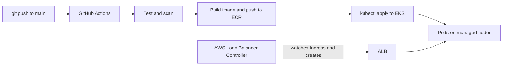

# Temperature Converter: Automated EKS Deployment with GitHub Actions

A small interactive Flask app (a browser UI plus a JSON API) deployed to Amazon EKS behind an Application Load Balancer (ALB). GitHub Actions tests the code, builds the Docker image, pushes it to Amazon ECR, and rolls it out to the cluster. AWS authentication uses GitHub OIDC, so **no AWS access keys are stored in the repo**.

## How it fits together



## The app

| Path | What it does |
|---|---|
| `/` | Browser UI. Converts as you type between Celsius, Fahrenheit and Kelvin. |
| `/api/convert?value=100&from=celsius&to=fahrenheit` | JSON API for any pair of the three units. |
| `/convert?celsius=25` | Original endpoint, kept for backward compatibility. |
| `/health` | JSON health check. |

Invalid input (not a number, NaN, or below absolute zero) returns a `400` with an `error` message.

## Repository layout

```
.
├── .github/
│   └── workflows/
│       └── eks.yaml            # CI/CD: test, build and push, deploy
├── K8/
│   ├── deployment.yaml         # runs the app as pods
│   ├── service.yaml            # stable in-cluster networking for the pods
│   └── ingress.yaml            # asks the ALB controller for a public ALB
├── app.py                      # Flask application (UI and API in one file)
├── cluster.yaml                # eksctl cluster definition
├── Dockerfile                  # builds the image, runs gunicorn
├── iam_policy.json             # IAM policy for the ALB controller (used in step 6)
├── README.md
├── requirements.txt            # flask and gunicorn
└── test_app.py                 # pytest tests, run in CI
```

## Prerequisites

- An AWS account on the **Paid plan**. The Free plan blocks instance types such as `t3.medium`, and node group creation fails with "not eligible for Free Tier".
- Locally: `aws` CLI v2, `eksctl` (recent enough to support the Kubernetes version in `cluster.yaml`), `kubectl`, `helm`, `docker`.
- One region everywhere. This guide uses `eu-west-3`. A region mismatch between commands is a common cause of confusing errors.
- Worker nodes of **`t3.medium` or larger**. A `t3.micro` allows only about 4 pods, which the mandatory system pods alone fill up.
- **Replace every placeholder** (anything in angle brackets such as `<OWNER>`) with a real value before running a command. The commands below read your AWS account ID from a variable so you never have to type it.

> **Two different OIDC providers are involved, and they are easy to confuse.**
> GitHub's lets the *pipeline* get AWS credentials. The cluster's own lets *pods* (such as the ALB controller) get AWS credentials.

## One-time setup (run in this order)

Each step depends on the one before it. The ALB controller needs the cluster, so it comes after cluster creation.

Run this once in the terminal session you will use for the steps below:

```bash
export ACCOUNT_ID=$(aws sts get-caller-identity --query Account --output text)
echo "$ACCOUNT_ID"      # should print your 12-digit account ID
```

### 1. Register GitHub as an identity provider in IAM

Once per AWS account. Skip it if the provider already exists.

```bash
aws iam create-open-id-connect-provider \
  --url https://token.actions.githubusercontent.com \
  --client-id-list sts.amazonaws.com \
  --thumbprint-list 6938fd4d98bab03faadb97b34396831e3780aea1
```

### 2. Create the IAM role the pipeline assumes

This guide calls the role `temperature_app_eks`. The pattern is the same as any GitHub OIDC role:

- **Trust policy:** principal is the GitHub OIDC provider, `aud` is `sts.amazonaws.com`, and `sub` is scoped to `repo:<OWNER>/<REPO>:ref:refs/heads/main`.
- **Permissions:** push to ECR (`ecr:GetAuthorizationToken`, `ecr:BatchCheckLayerAvailability`, `ecr:InitiateLayerUpload`, `ecr:UploadLayerPart`, `ecr:CompleteLayerUpload`, `ecr:PutImage`) and `eks:DescribeCluster`.

### 3. Create the ECR repository

```bash
aws ecr create-repository \
  --repository-name temp-converter-api \
  --image-scanning-configuration scanOnPush=true \
  --region eu-west-3
```

### 4. Create the cluster

`cluster.yaml`:

```yaml
apiVersion: eksctl.io/v1alpha5
kind: ClusterConfig

metadata:
  name: my-eks-cluster
  region: eu-west-3
  version: "1.36"

availabilityZones: ["eu-west-3a", "eu-west-3b"]

iam:
  withOIDC: true          # creates the cluster's own OIDC provider (needed in step 6)

managedNodeGroups:
  - name: cicd-nodegroup
    instanceType: t3.medium
    desiredCapacity: 2
    minSize: 1
    maxSize: 3
    volumeSize: 20
    privateNetworking: true
```

```bash
eksctl create cluster -f cluster.yaml     # takes 15-20 minutes
kubectl get nodes                         # both nodes should be Ready
```

`eksctl` builds the VPC, subnets, NAT gateway, IAM roles and security groups, and updates your local kubeconfig. Use the same cluster name in every later command.

### 5. Give the pipeline's role access inside the cluster

IAM permission lets the pipeline *find* the cluster. Kubernetes has its own authorization, so without an access entry `kubectl` returns `Unauthorized`.

The access entry is for the **pipeline's IAM role**. It has nothing to do with the ALB controller's service account.

```bash
# The namespace the app deploys into. Create it once, as the cluster admin.
kubectl create namespace temp-app

aws eks create-access-entry \
  --cluster-name my-eks-cluster \
  --principal-arn arn:aws:iam::${ACCOUNT_ID}:role/temperature_app_eks \
  --region eu-west-3

aws eks associate-access-policy \
  --cluster-name my-eks-cluster \
  --principal-arn arn:aws:iam::${ACCOUNT_ID}:role/temperature_app_eks \
  --policy-arn arn:aws:eks::aws:cluster-access-policy/AmazonEKSEditPolicy \
  --access-scope type=namespace,namespaces=temp-app \
  --region eu-west-3
```

The `namespaces` value must match the namespace in your manifests and workflow. Confirm the entry exists:

```bash
aws eks list-access-entries --cluster-name my-eks-cluster --region eu-west-3
```

### 6. Install the AWS Load Balancer Controller

The controller runs as pods in the cluster. It watches for `Ingress` resources and **creates the ALB itself** in response. Without it, an Ingress just sits there with no address.

This is done **once per cluster, by hand**. The pipeline does not install or manage it. Check first whether it is already running, and skip this step if it is:

```bash
kubectl get deployment -n kube-system aws-load-balancer-controller    # 2/2 ready means it is installed
```

If you rebuild the cluster, repeat this step, because the new cluster has a new OIDC provider.

**a. IAM policy.** Defines what the controller may do in AWS (create load balancers, target groups, and so on). The repo already contains `iam_policy.json`. To download a fresh copy, use the policy version that matches the controller release:

```bash
curl -o iam_policy.json https://raw.githubusercontent.com/kubernetes-sigs/aws-load-balancer-controller/main/docs/install/iam_policy.json
```

Create the policy once per AWS account, and skip this command if it already exists:

```bash
aws iam create-policy \
  --policy-name AWSLoadBalancerControllerIAMPolicy \
  --policy-document file://iam_policy.json

# Confirm it exists before the next step
aws iam get-policy --policy-arn arn:aws:iam::${ACCOUNT_ID}:policy/AWSLoadBalancerControllerIAMPolicy
```

**b. IAM service account.** Kubernetes identities (service accounts) and AWS identities (IAM roles) are separate systems. This command creates an IAM role, attaches the policy to it, creates a Kubernetes service account, and links the two through the cluster's OIDC provider. Pods running as that service account get temporary AWS credentials for that role.

```bash
eksctl create iamserviceaccount \
  --cluster my-eks-cluster \
  --region eu-west-3 \
  --namespace kube-system \
  --name aws-load-balancer-controller \
  --attach-policy-arn arn:aws:iam::${ACCOUNT_ID}:policy/AWSLoadBalancerControllerIAMPolicy \
  --override-existing-serviceaccounts \
  --approve
```

**c. Helm repo and install.** Helm is Kubernetes' package manager. The repo is where AWS publishes the controller's packaged manifests (a "chart"), and `helm install` unpacks them into your cluster.

```bash
VPC_ID=$(aws eks describe-cluster \
  --name my-eks-cluster --region eu-west-3 \
  --query "cluster.resourcesVpcConfig.vpcId" --output text)

helm repo add eks https://aws.github.io/eks-charts
helm repo update

helm upgrade --install aws-load-balancer-controller eks/aws-load-balancer-controller \
  --namespace kube-system \
  --set clusterName=my-eks-cluster \
  --set serviceAccount.create=false \
  --set serviceAccount.name=aws-load-balancer-controller \
  --set region=eu-west-3 \
  --set vpcId="$VPC_ID"
```

`serviceAccount.create=false` is deliberate: `eksctl` already created the service account with the IAM link in step b.

**d. Verify.**

```bash
kubectl get deployment -n kube-system aws-load-balancer-controller    # expect 2/2 ready
```

## Container requirements

The container must run the app with **gunicorn, bound to `0.0.0.0`**, not with `python app.py`.

`Dockerfile`:

```dockerfile
EXPOSE 8080
CMD ["gunicorn", "--bind", "0.0.0.0:8080", "app:app"]
```

`requirements.txt` must list both packages:

```
flask==3.0.3
gunicorn==22.0.0
```

- `0.0.0.0` means "accept connections from outside the container". The ALB sends traffic to the pod's IP address, so an app bound to `127.0.0.1` is unreachable and the ALB returns a 502.
- `app:app` means "the variable `app` inside the file `app.py`".
- gunicorn is the production server. Flask's built-in server prints a "development server" warning and is not meant for real traffic.

## Deploy

Push to `main`. The pipeline in `.github/workflows/eks.yaml` runs these stages in order, and each only starts if the previous one passed:

1. **Test and scan:** lint, `pytest`, SAST (Bandit), dependency scan (`pip-audit`).
2. **Build and push:** authenticate to AWS with OIDC, build the image, push it to ECR.
3. **Deploy:** authenticate with OIDC, `kubectl apply -f K8/`, wait for the rollout.

Optional: point the ALB's health check at the dedicated endpoint by adding this annotation to `K8/ingress.yaml`:

```yaml
metadata:
  annotations:
    alb.ingress.kubernetes.io/healthcheck-path: /health
```

## Verify

```bash
kubectl get nodes
kubectl get pods -n temp-app
kubectl get svc -n temp-app
kubectl get ingress -n temp-app     # ADDRESS shows the ALB DNS name after about 2-3 minutes

curl http://<ALB_DNS_NAME>/health
curl "http://<ALB_DNS_NAME>/api/convert?value=100&from=celsius&to=fahrenheit"
```
Then open `http://<ALB_DNS_NAME>/` in a browser for the UI.


An empty `ADDRESS` means the ALB controller is not running, is not ready, or lacks IAM permission. Check `kubectl logs -n kube-system deployment/aws-load-balancer-controller`.

## Troubleshooting

### 502 Bad Gateway from the ALB

A 502 means the ALB is working but the pods behind it are not giving it a valid response. The pods can show `Running` and still cause this.

**1. Check the pods and their logs.**

```bash
kubectl get pods -n temp-app -o wide
kubectl logs -n temp-app deploy/temp-app --tail=20
```

| The log shows | Meaning |
|---|---|
| `Listening at: http://0.0.0.0:8080` (gunicorn) | The app is reachable. Look at target health in step 3. |
| `Running on http://127.0.0.1:8080` and a "development server" warning | **This is the problem.** The container runs `python app.py` and listens only on loopback, so the ALB cannot reach it. |

**2. Fix it.** Make sure the `Dockerfile` ends with the gunicorn `CMD` shown under **Container requirements**, that `requirements.txt` includes `gunicorn`, then push so the pipeline rebuilds and rolls out the image.

**3. Check target health in AWS.** EC2 console, then Target Groups, select the group the controller created, then the **Targets** tab. The health status and its reason code show what the ALB is complaining about. New pods can take a minute or two to register, so a short burst of 502s right after a rollout is normal.

> `kubectl port-forward` connects from inside the pod, so it works even when the app is bound to `127.0.0.1`. A successful port-forward does not prove the ALB can reach the app. The log line above is the reliable check.

### Other common problems

| Symptom | Likely cause | Fix |
|---|---|---|
| Controller pods stuck `Pending`, "Too many pods" | Nodes too small (`t3.micro`) | Use `t3.medium` or larger |
| Node group `CREATE_FAILED`, "not eligible for Free Tier" | AWS Free plan restriction | Upgrade to the Paid plan (not reversible) |
| Ingress has no `ADDRESS` | Controller missing, not ready, or no IAM role | Check controller pods and logs (step 6) |
| Pipeline `kubectl` returns `Unauthorized` | No access entry for the pipeline role | Step 5 |
| Pipeline `kubectl` returns `Forbidden` for a namespace | Access policy scoped to a different namespace | Re-run `associate-access-policy` with the namespace the app deploys to (`temp-app`) |
| `eksctl create iamserviceaccount` fails, "policy does not exist" | A placeholder such as `ACCOUNT_ID` was not replaced, or the policy was never created | Use the `${ACCOUNT_ID}` variable, confirm with `aws iam get-policy`, delete the failed CloudFormation stack, then retry |
| New image pushed but pods unchanged | `:latest` tag leaves the manifest unchanged, so nothing rolls out | Tag images with `${{ github.sha }}` and set that tag in the Deployment |
| `docker login` to ECR returns `400 Bad Request` | Token region differs from registry region | Use the same `--region` in both halves of the command |

## Cleanup (cost control)

The EKS control plane, nodes, NAT gateway and ALB all bill by the hour.

```bash
kubectl delete -f K8/ingress.yaml                        # lets the controller delete the ALB first
helm uninstall aws-load-balancer-controller -n kube-system
eksctl delete cluster -f cluster.yaml
```

Delete the Ingress **before** the cluster. Otherwise the ALB and its security groups can be orphaned and block VPC deletion. Afterwards, check for leftover Elastic IPs and NAT gateways, and delete old ECR images if you no longer need them.

---

## Tech stack

AWS (EKS, ECR, ALB, IAM with OIDC), Kubernetes, Docker, GitHub Actions, eksctl, Helm, Python, Flask, gunicorn and pytest. Terraform is planned next.

## Author

**Jane Obikwelu**

Cloud and DevOps Engineer | Aspiring Solutions Architect

This project is part of my hands-on work in cloud infrastructure and CI/CD automation: building, securing and operating containerized applications on AWS.

- GitHub: [Dekasrepo](https://github.com/Dekasrepo)
- LinkedIn: [Jane Obikwelu](https://www.linkedin.com/in/jane-obikwelu)
- Email: janeobikwelu@gmail.com